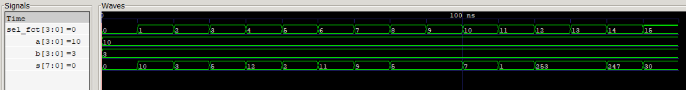
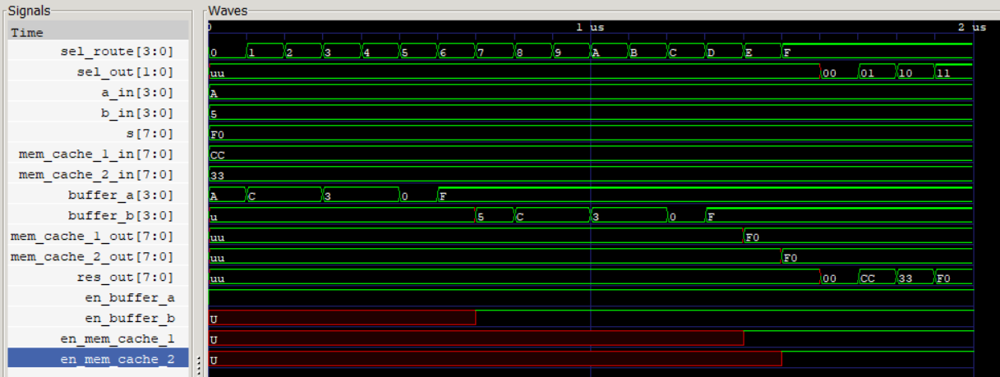

# LogiGame

# Projet Microcontrôleur Simple en VHDL
Ce projet consiste à concevoir un cœur de microcontrôleur simple en VHDL, puis à le tester sur une carte de développement ARTY intégrant un FPGA Artix-35T de Xilinx. Une fois le cœur de microcontrôleur fonctionnel, il sera utilisé pour exécuter un jeu interactif. De plus, des blocs fonctionnels complémentaires seront créés en VHDL pour permettre au jeu de fonctionner correctement sur le FPGA.

---

## Installation et Lancement

### 1. UAL 
- File VALCORE_ARCH 
```
ghdl -a -g -fsynopsys --std=08 .\VALCORE_ARCH.vhd
ghdl -e -fexplicit --ieee=synopsys --std=08 VALCORE
ghdl -r -fexplicit --ieee=synopsys --std=08 VALCORE
```
- File TBvalcore_arch.vhd (TestBench)
```
ghdl -a --std=08 VALCORE_ARCH.vhd
ghdl -a --std=08 TBvalcore_arch.vhd
ghdl -e --std=08 tb_valcore
ghdl -r --std=08 tb_valcore --wave=TBvalcore.ghw
```
- GTK wave : 


### 2. INTERCONNECTION 
- File Interconnection.vhd
```
ghdl -a -g -fsynopsys --std=08 .\interconnection.vhd
ghdl -e -fexplicit --ieee=synopsys --std=08 interco
ghdl -r -fexplicit --ieee=synopsys --std=08 interco
```
- File TBinterconnection.vhd (TestBench)
```
ghdl -a --std=08 .\TBinterconnection.vhd
ghdl -a --std=08 .\interconnection.vhd  
ghdl -e --std=08 tb_interco     
ghdl -r --std=08 tb_interco  --wave=TBinterco.ghw 
```
- GTK wave : 


### 3. MEMORY UNIT 

BUFFER A : 
```
ghdl -a -g -fsynopsys --std=08 .\BUFFER_A.vhd
ghdl -e -fexplicit --ieee=synopsys --std=08 BUFFER_A
ghdl -r -fexplicit --ieee=synopsys --std=08 BUFFER_A
```
BUFFER B : 
```
ghdl -a -g -fsynopsys --std=08 .\BUFFER_B.vhd
ghdl -e -fexplicit --ieee=synopsys --std=08 BUFFER_B
ghdl -r -fexplicit --ieee=synopsys --std=08 BUFFER_B
```
