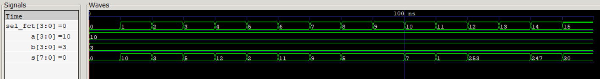
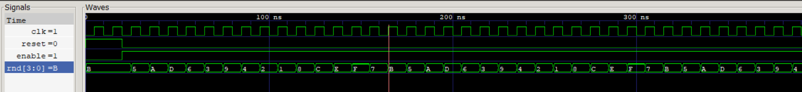

# LogiGame - Microcontrôleur en VHDL avec Jeu Interactif

## Description du Projet
Ce projet consiste à concevoir un cœur de microcontrôleur simple en VHDL, puis à le tester sur une carte de développement ARTY intégrant un FPGA Artix-35T de Xilinx. Une fois le cœur de microcontrôleur fonctionnel, il sera utilisé pour exécuter un jeu interactif. Des blocs fonctionnels complémentaires seront créés en VHDL pour permettre au jeu de fonctionner correctement sur le FPGA.

## Architecture du Microcontrôleur

### Coeur de controlleur
1. **Top Level** 
2. **Unité Arithmétique et Logique (UAL)**
   - UAL 
   - UAL Sel_Out
   - UAL Sel_Route
3. **Buffers**
   - CMD Buffers
   - UAL Buffers
4. **Mémoire d'Instructions**
    - Memory Instruction

### Résultats de Simulation
- **UAL**  
  
  
- **LSFR** (Générateur de Séquence Pseudo-Aléatoire) 
  

## Module de Jeu

### Générateur de Séquence Pseudo-Aléatoire
Implémentation d'un LFSR (Linear Feedback Shift Register) de 4 bits pour générer des séquences aléatoires.

### Génération d’un minuteur programmable permettant de gérer la difficulté du jeu 
A FINIR

### Génération d’un compteur de score pour le jeu
PAS FAIT

### Génération d’un vérificateur de résultat pour le jeu
PAS FAIT

### Synthèse du contrôleur de jeu

### Top level
lien entre le contrôleur logique et la carte FPGA physique.

PAS FAIT
## Lancement des simulations
 - UAL 
````bash 
cd .\UAL\
ghdl -a --std=08 .\ual.vhd .\TBual.vhd
ghdl -e --std=08 tb_valcore
ghdl -r --std=08 tb_valcore --wave=TBual.ghw
````
 - Top_level
 - Penser d'abord à charger les fichiers suivants dans le répertoire Top_Level :
   -  Ual ```ghdl -a --std=08 C:[chemin vers le repertoire] LogiGame\Coeur_Controleur\UAL\ual.vhd```
   -  Ual_selout  ```ghdl -a --std=08 C:[chemin vers le repertoire] LogiGame\Coeur_Controleur\UAL\ual_selout.vhd```
   -  Ual_selroute  ```ghdl -a --std=08 C:[chemin vers le repertoire] LogiGame\Coeur_Controleur\UAL\ual_selroute.vhd```
   -  Buffer_cmd ```ghdl -a --std=08 C:[chemin vers le repertoire] LogiGame\Coeur_Controleur\Buffers\buffer_cmd.vhd```
   -  Buffer_cmd ```ghdl -a --std=08 C:[chemin vers le repertoire] LogiGame\Coeur_Controleur\Buffers\buffer_ual.vhd```
   -  Mem_control ```ghdl -a --std=08 C:[chemin vers le repertoire] LogiGame\Coeur_Controleur\MemoryUnit\mem_control.vhd```
   - 
```BASH
cd .\Coeur_Controleur\Top_Level\
ghdl -a --std=08 .\Top_level.vhd .\tb_top_level.vhd
ghdl -e --std=08 tb_Top_level
ghdl -r --std=08 tb_Top_level --wave=tb_Top_level.ghw
```
---
 - Generateur Aléatoire 
```BASH
cd .\Générateur_Aléatoire\
ghdl -a --std=08 .\lsfr4bits.vhd .\TBlsfr4bits.vhd
ghdl -e --std=08 TBlsfr4bits
ghdl -r --std=08 TBlsfr4bits --wave=TBlsfr4bits.ghw
```
 - Compteur
```BASH
cd .\Logique_de_jeu\Compteur\
ghdl -a --std=08 .\compteur.vhd .\TBcompteur.vhd
ghdl -e --std=08 tb_compteur
ghdl -r --std=08 tb_compteur --wave=TBcompteur.ghw
```
 - Minuteur
```BASH
cd .\Logique_de_jeu\Minuteur_difficulte
ghdl -a --std=08 .\minuteur.vhd .\TBminuteur.vhd
ghdl -e --std=08 tb_minuteur
ghdl -r --std=08 tb_minuteur --wave=TBminuteur.ghw
```
 - Verification du resultat
```BASH
cd .\Logique_de_jeu\Verificateur_Resultat\
ghdl -a --std=08 .\verificateur.vhd .\TBverificateur.vhd
ghdl -e --std=08 tb_verificateur
ghdl -r --std=08 tb_verificateur --wave=verificateur.ghw
```
